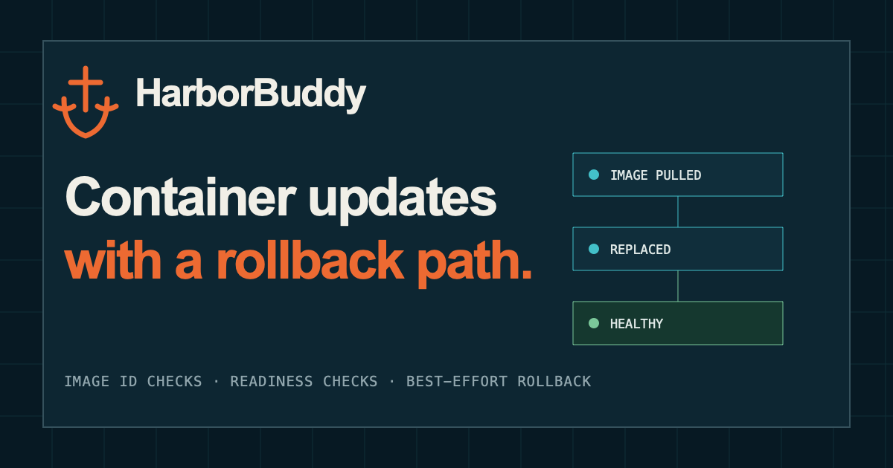

# HarborBuddy

[](https://github.com/MikeO7/HarborBuddy/actions/workflows/ci.yml)
[](https://github.com/MikeO7/HarborBuddy/actions/workflows/docker-build.yml)
[](https://mikeo7.github.io/HarborBuddy/)
[](LICENSE)

[](https://mikeo7.github.io/HarborBuddy/)

**A careful, self-hosted Docker container updater with readiness checks and best-effort rollback.**

HarborBuddy watches the running containers on a standalone Docker Engine. It pulls each configured image reference, compares image IDs, and replaces a container only when the image behind that reference has changed. It keeps the stopped original container as a temporary backup until the replacement is ready.

This is useful when you want automatic Docker container updates but still want filters, dry runs, health checks, and a way back when a new image does not start cleanly.

> [!IMPORTANT]
> HarborBuddy is early-stage software and does not yet have a versioned release. The `latest` and `edge` image tags currently move with `main`; pin a `sha-*` tag or, better, an image digest when repeatable deployments matter.

> [!WARNING]
> HarborBuddy needs read/write access to the Docker API. Access to the Docker socket is effectively host-administrator access. HarborBuddy is also noncommercial source-available software under the [PolyForm Noncommercial License 1.0.0](LICENSE), not an open-source license.

[See the project site](https://mikeo7.github.io/HarborBuddy/) or [start with Docker Compose](#quick-start).

## What HarborBuddy does

- Checks for new container images on an interval or at a set time each day
- Updates only when the pulled image ID differs from the running image ID
- Re-inspects a container just before replacement to catch outside changes
- Waits for the new container's health check, or two seconds of process stability when no health check exists
- Attempts to restore the old container if creation, startup, or readiness fails
- Supports allow lists, deny lists, and a per-container opt-out label
- Can preview decisions in dry-run mode without recreating containers or deleting resources
- Cleans up old dangling images by default, with broader cleanup available only by opt-in
- Can update its own container through a short-lived helper
- Writes human-readable or JSON logs with stable event names and cycle IDs

Published images support `linux/amd64`, `linux/arm64`, and `linux/arm/v7`.

## Know the boundaries

HarborBuddy is built for one standalone Docker Engine, not Docker Swarm. Run one HarborBuddy controller per daemon.

An update is not zero-downtime: HarborBuddy stops the old container before it starts the replacement. Rollback is best-effort because Docker or the host can also fail during recovery. Use container health checks, keep backups for stateful services, and opt databases or migration-sensitive workloads out of unattended updates.

HarborBuddy skips containers it cannot recreate safely, including:

- Docker Swarm tasks
- Containers created with auto-remove
- Containers sharing another container's network, PID, IPC, or UTS namespace
- Containers with mount types or inspected mount data that cannot be reproduced safely

HarborBuddy recreates containers from Docker's inspection data; it does not invoke Docker Compose or reread a Compose file. It also sends no registry authentication with image pulls, so authenticated private registries are not currently supported.

Updates, self-update, and cleanup are enabled by default. The default cleanup policy deletes dangling images older than 24 hours. Start with dry-run and filters if you do not want every eligible running container managed immediately.

## Quick start

Create `compose.yaml`:

```yaml
services:
  harborbuddy:
    image: ghcr.io/mikeo7/harborbuddy:edge
    container_name: harborbuddy
    restart: unless-stopped
    volumes:
      - /var/run/docker.sock:/var/run/docker.sock
    environment:
      TZ: UTC
      HARBORBUDDY_SCHEDULE_TIME: "03:00"
      HARBORBUDDY_CONTAINER_NAME: harborbuddy
      # Keep the first run observational. Remove after reviewing the logs.
      HARBORBUDDY_DRY_RUN: "true"
      # Automatic self-update is on by default. To turn it off:
      # HARBORBUDDY_SELF_UPDATE_ENABLED: "false"
    labels:
      com.harborbuddy.role: daemon
```

Start it and follow the logs:

```bash
docker compose up -d
docker compose logs -f harborbuddy
```

The example runs every day at 03:00 UTC in dry-run mode. Review the logs and set your allow/deny filters before removing `HARBORBUDDY_DRY_RUN`. Remove `HARBORBUDDY_SCHEDULE_TIME` to use the default 12-hour interval instead.

For a fuller starting point, see [examples/docker-compose.yml](examples/docker-compose.yml) and [examples/harborbuddy.yml](examples/harborbuddy.yml).

### Try a dry run first

Dry-run mode pulls eligible images so HarborBuddy can compare their real image IDs. That uses network bandwidth and changes Docker's local image cache, but it does not stop, rename, recreate, or remove containers. Cleanup is reported without deleting anything.

```bash
docker run --rm \
  -v /var/run/docker.sock:/var/run/docker.sock \
  ghcr.io/mikeo7/harborbuddy:edge \
  --once --dry-run
```

Or add this to the Compose environment:

```yaml
HARBORBUDDY_DRY_RUN: "true"
```

## How an update works

For each eligible running container, HarborBuddy:

1. Pulls the image reference stored in the container configuration.
2. Compares the pulled image ID with the running image ID.
3. Re-inspects the container and checks that it has not changed during the cycle.
4. Temporarily disables the old restart policy when the Docker API supports it, stops the container, disconnects its networks, and gives it a temporary backup name.
5. Creates a replacement with the inspected container and host configuration, reusable mounts, original name, and network attachments.
6. Starts the replacement and waits for Docker to report it healthy, or for two seconds of process stability if it has no health check.
7. Removes the backup after the replacement is ready.

If a step fails after replacement begins, HarborBuddy attempts to remove the failed replacement, restore the old container's name, networks, and restart policy, and start it again. A failure to remove the backup after a successful update is logged as a warning.

## Choose which containers update

Running containers are eligible by default. Opt a container out with a label:

```yaml
labels:
  com.harborbuddy.autoupdate: "false"
```

This is a sensible default for databases and services that require a manual migration.

You can also narrow updates with `updates.allow_images` and `updates.deny_images`. Deny rules win. Patterns support an exact value or one `*` at either edge:

```yaml
updates:
  allow_images:
    - "ghcr.io/my-org/*"
    - "nginx:*"
  deny_images:
    - "*:latest"
```

## Configuration

HarborBuddy looks for `/config/harborbuddy.yml`. If that implicit default file is missing, HarborBuddy uses these defaults. A path explicitly supplied with `--config` or `HARBORBUDDY_CONFIG` must exist.

```yaml
docker:
  host: ""

updates:
  enabled: true
  check_interval: 12h
  schedule_time: ""
  timezone: UTC
  dry_run: false
  self_update: true
  allow_images:
    - "*"
  deny_images: []
  stop_timeout: 10s
  startup_timeout: 30s

cleanup:
  enabled: true
  min_age_hours: 24
  dangling_only: true
  all: false
  stopped_containers: false
  unused_networks: false
  unused_volumes: false
  build_cache: false

log:
  level: info
  json: false
  file: ""
  max_size: 10
  max_backups: 1
```

Mount a config file read-only:

```yaml
volumes:
  - ./harborbuddy.yml:/config/harborbuddy.yml:ro
```

YAML parsing is strict. Unknown fields and multiple YAML documents cause startup to fail. When `updates.schedule_time` is set, HarborBuddy uses that daily `HH:MM` time in `updates.timezone`; otherwise it uses `updates.check_interval`.

### Environment variables

Environment variables override YAML settings.

| Variable | Default | What it controls |
| --- | --- | --- |
| `HARBORBUDDY_CONFIG` | `/config/harborbuddy.yml` | Configuration file path |
| `HARBORBUDDY_DOCKER_HOST` | empty | Explicit Docker endpoint; overrides `DOCKER_HOST` |
| `HARBORBUDDY_INTERVAL` | `12h` | Update interval |
| `HARBORBUDDY_SCHEDULE_TIME` | empty | Daily run time in `HH:MM` |
| `HARBORBUDDY_TIMEZONE` | `UTC` | IANA timezone; takes precedence over `TZ` |
| `TZ` | empty | Standard timezone fallback |
| `HARBORBUDDY_DRY_RUN` | `false` | Pull and report without replacement or cleanup deletion |
| `HARBORBUDDY_UPDATES_ENABLED` | `true` | Enable update checks |
| `HARBORBUDDY_SELF_UPDATE_ENABLED` | `true` | Let HarborBuddy update its own container |
| `HARBORBUDDY_CONTAINER_NAME` | empty | Stable name used to identify the HarborBuddy container |
| `HARBORBUDDY_CONTAINER_ID` | empty | Optional container ID or unique prefix of at least 12 characters |
| `HARBORBUDDY_STOP_TIMEOUT` | `10s` | Graceful stop timeout |
| `HARBORBUDDY_STARTUP_TIMEOUT` | `30s` | Replacement readiness timeout |
| `HARBORBUDDY_CLEANUP_ENABLED` | `true` | Enable cleanup in normal scheduled and one-shot cycles |
| `HARBORBUDDY_CLEANUP_MIN_AGE_HOURS` | `24` | Minimum cleanup candidate age |
| `HARBORBUDDY_CLEANUP_DANGLING_ONLY` | `true` | Restrict image cleanup to untagged images |
| `HARBORBUDDY_CLEANUP_ALL` | `false` | Enable every broader cleanup category |
| `HARBORBUDDY_CLEANUP_STOPPED_CONTAINERS` | `false` | Remove old stopped containers |
| `HARBORBUDDY_CLEANUP_UNUSED_NETWORKS` | `false` | Remove old unused local networks |
| `HARBORBUDDY_CLEANUP_UNUSED_VOLUMES` | `false` | Remove old unreferenced volumes with known age |
| `HARBORBUDDY_CLEANUP_BUILD_CACHE` | `false` | Prune old unused build cache |
| `HARBORBUDDY_LOG_LEVEL` | `info` | `debug`, `info`, `warn`, or `error` |
| `HARBORBUDDY_LOG_JSON` | `false` | Write JSON logs |
| `HARBORBUDDY_LOG_FILE` | empty | Optional rotating log path; stdout stays enabled |
| `HARBORBUDDY_LOG_MAX_SIZE` | `10` | Rotation size in MiB |
| `HARBORBUDDY_LOG_MAX_BACKUPS` | `1` | Number of rotated files to keep |

Invalid environment values and invalid configured schedules are rejected at startup instead of silently falling back.

### Docker connection and TLS

When `docker.host` and `HARBORBUDDY_DOCKER_HOST` are empty, the Docker SDK uses its standard variables:

- `DOCKER_HOST`
- `DOCKER_TLS_VERIFY`
- `DOCKER_CERT_PATH`
- `DOCKER_API_VERSION`

For example:

```yaml
environment:
  DOCKER_HOST: tcp://docker.example.net:2376
  DOCKER_TLS_VERIFY: "1"
  DOCKER_CERT_PATH: /certs/client
volumes:
  - ./certs/client:/certs/client:ro
```

Never expose an unauthenticated Docker TCP endpoint. A remote daemon must be secured and reachable from both HarborBuddy and its self-update helper.

### Migrating older configuration

The current schema no longer accepts `docker.tls`, `updates.update_all`, or the top-level `logging` block. Use the Docker SDK's `DOCKER_*` variables, the allow/deny settings, and the `log` block shown above.

## Automatic self-update

Self-update is enabled by default. HarborBuddy cannot replace its own running container directly, so it starts a short-lived helper from the new image and then exits cleanly. The helper performs the same replacement and readiness process, keeping the old HarborBuddy container as a backup until the new one starts successfully.

Set `HARBORBUDDY_CONTAINER_NAME` to the stable Compose container name so HarborBuddy can identify itself. Set it explicitly when managing a remote daemon because local Linux runtime identity cannot reliably identify a remote container. The `com.harborbuddy.role=daemon` label protects an unidentified HarborBuddy container from the ordinary update path, but it is not treated as proof of identity.

To keep HarborBuddy itself under manual change control:

```yaml
environment:
  HARBORBUDDY_SELF_UPDATE_ENABLED: "false"
```

If self-update fails, inspect both the daemon and helper logs, fix the Docker access or configuration issue, then use the manual fallback:

```bash
docker compose pull harborbuddy
docker compose up -d --no-deps harborbuddy
```

## Cleanup

The default cleanup policy removes only dangling images older than 24 hours. Every broader category is off until you enable it:

- `stopped_containers`
- unused tagged images through `dangling_only: false`
- `unused_networks`
- `unused_volumes`
- `build_cache`

`all: true` or `HARBORBUDDY_CLEANUP_ALL=true` enables all of them. Individual switches are safer on shared hosts.

System networks, running containers, attached networks, referenced volumes, active build-cache records, and resources with unknown age or usage are skipped. For containers, networks, and volumes, minimum age is based on creation time, not time since the resource became stopped or unused. An old resource can therefore become eligible as soon as its final reference is gone. Volume cleanup can permanently delete application data, and HarborBuddy cannot know whether an unused volume still matters to you.

## Logs and CLI

Logs go to standard output. Set `HARBORBUDDY_LOG_JSON=true` for JSON or `HARBORBUDDY_LOG_FILE` for an additional rotating file. Update records include container, image, transaction, failure, and rollback fields; scheduled work shares a `cycle_id`. Send `SIGUSR1` to switch temporarily to debug logging, then send it again to restore the configured level.

```text
--config PATH          configuration file
--interval DURATION    override the update interval
--schedule-time HH:MM  override the daily schedule
--timezone ZONE        override the schedule timezone
--once                 run one cycle and exit
--dry-run              pull and report without replacement or cleanup deletion
--cleanup-only         run cleanup and exit
--log-level LEVEL      override the log level
--version              print build information
```

## Development

HarborBuddy is written in Go. To run the full local verification suite:

```bash
go mod download
make verify-local
```

The suite covers formatting, source limits, vet, lint, vulnerability checks, unit coverage, the race detector, bounded fuzzing, a binary build, non-Go linters, and disposable Docker or Podman integration tests. Podman is supported as a local compatibility test engine; production targets standalone Docker Engine.

See [CONTRIBUTING.md](CONTRIBUTING.md), [SECURITY.md](SECURITY.md), [docs/repository-policy.md](docs/repository-policy.md), and [test/README.md](test/README.md).

## License

HarborBuddy is available under the [PolyForm Noncommercial License 1.0.0](LICENSE). Personal and other permitted noncommercial uses are allowed; commercial use is not.
